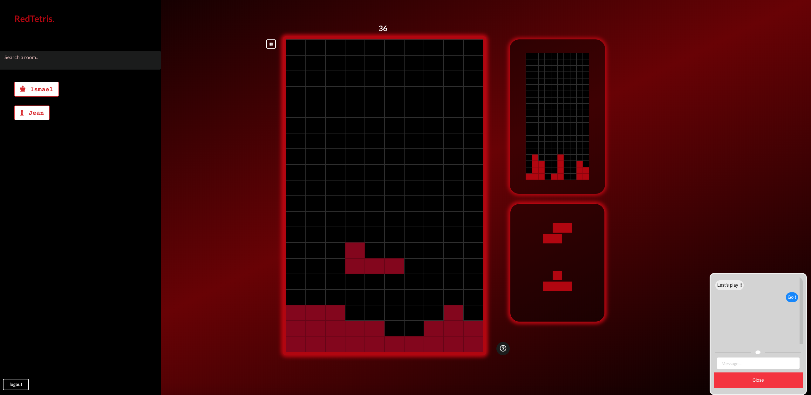

# Red Tetris


School **42** project: multiplayers tetris, Full Stack Javascript.



## Technologies
* **Backend**
    * **_Node-js_** 11.4.0
    * **_Socket.io_** 2.2.0
    * **_Mongoose_** 5.4.8
* **Frontend**
    * **_React_** 16.8.4
    * **_Socket.io-client_** 2.2.0
    * **_Redux_** 4.0.1
    * **_redux-thunk_** 2.3.0
    * **_semantic-ui-react_** 0.85.0
* **Tests**
    * **_Jest_** 24.5.0
    * **_Enzyme_** 3.9.0
    * **_Jsdom_** 14.0.0
* **Others**
    * **_Webpack_** 4.29.6
    * **_ramda_** 0.26.1

### Dependencies
* mongodb
* yarn

### Setup
> create a database folder
```
mkadir <path to data folder>/data
mkadir <path to data folder>/data/red_tetris
```
```
mongod --dbpath <path to root>/data/red_tetris
yarn
yarn build
yarn server 
```

Now go on localhost at : `http://0.0.0.0:8080`


**Note**: To play on your network:
In `./params.js` replace `host` value with your network ip. 